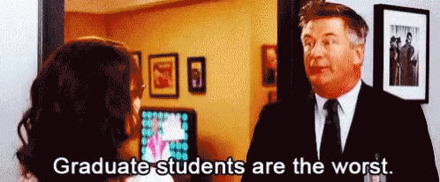
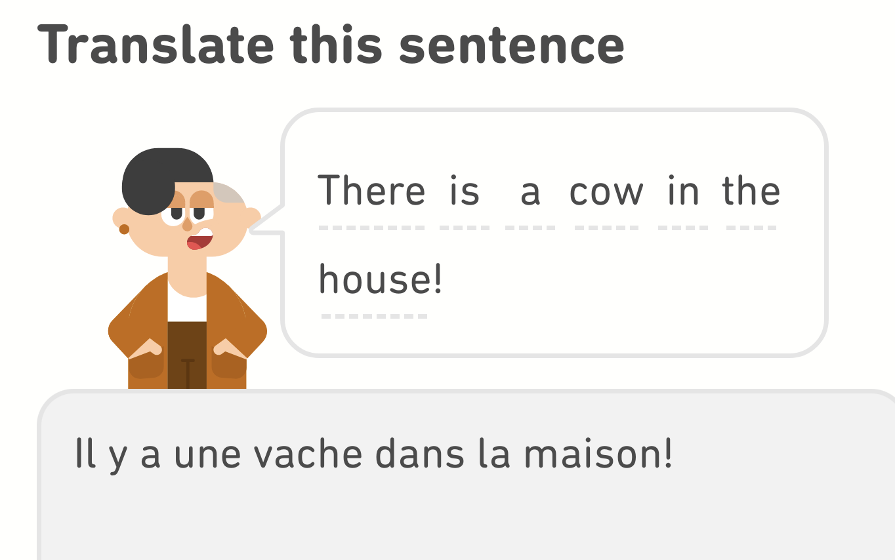
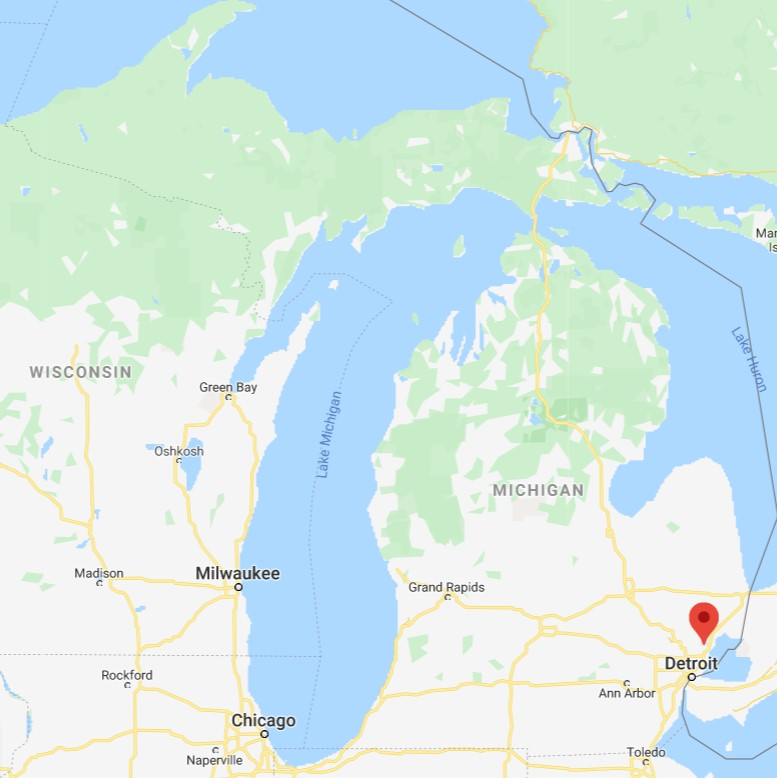
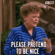
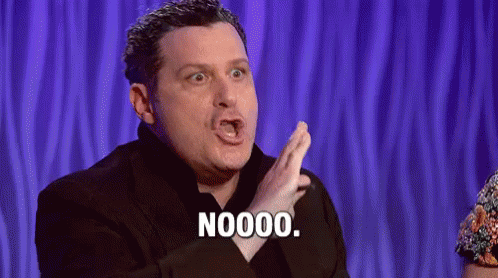
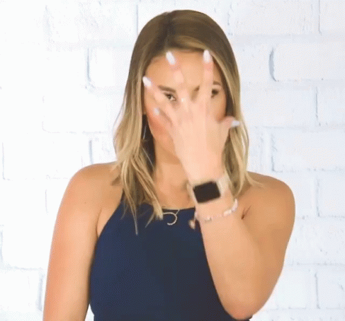
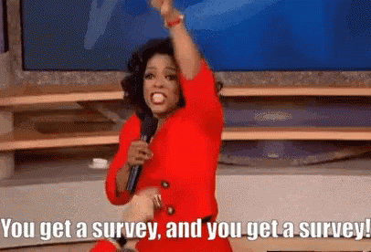

class: center

```{r setup, include=FALSE}
options(htmltools.dir.version = FALSE)
knitr::opts_chunk$set(echo = TRUE, include = TRUE, eval = TRUE, comment = NA)
```

```{r xaringan-themer, include = FALSE, warning = FALSE}
library(xaringanthemer)
# style_mono_light(base_color = "#00274c",
#                  header_font_google = google_font("DM Serif Display"),
#                  text_font_google = google_font("PT Sans", "400", "400i")
# )
style_duo(primary_color = "#00274c",
          secondary_color = "#ffcb05",
          header_font_google = google_font("DM Serif Display"),
          text_font_google = google_font("PT Sans", "400", "400i", "600"),
          code_font_google = google_font("Roboto Mono", "400"),
          text_font_size = "22pt"
)
```

```{r share-again, echo=FALSE}
xaringanExtra::use_share_again()
xaringanExtra::style_share_again(share_buttons = "none", foreground = "rgba(0,0,0,0)")
```

# Who am I? `r emo::ji("man_teacher")`

.pull-left[




]

.pull-right[



]

---
# Who are you? `r emo::ji("woman_student")`

** While you are taking this class, you are a statistician! **

1. Change your Zoom name to include pronouns    
  - Right-click (or long press) your name in the Participants list, select "Rename"
  
1. Add a photo to your Zoom profile
  - Go to umich.zoom.us, sign in, and choose "Profile" on the left
  - This will be used across all your U-M Zoom meetings
  
1. In the chat, type your favorite TV show **but don't hit enter it until I say go**.

---

# Course Policy

## Grading

.pull-left[
<table style="font-size:20pt;">
  <tr style="text-align:center;">
    <td><strong>Component</strong></td>
    <td><strong>Proportion of grade</strong></td>
  </tr>
  <tr style="color:var(--primary);">
    <td>Exams</td>
    <td>30% (15% &times; 2)</td>
  </tr>
  <tr>
    <td>Quizzes</td>
    <td>20% (10% &times; 2)</td>
  </tr>
  <tr style="color:var(--primary);"> 
    <td>Homework</td>
    <td>20% (12 total, 2 dropped)</td>
  </tr>
  <tr>
    <td>MWrite</td>
    <td>15% (5% + 10%)</td>
  </tr>
  <tr style="color:var(--primary);">
    <td>Lab Work</td>
    <td>10% (12 total, 1 dropped)</td>
  </tr>
  <tr>
    <td>Participation</td>
    <td>5% (1% eCoach + 1% Survey + 3% Piazza)</td>
  </tr>
</table>
]

.pull-right[
- Letter grades are assigned based on a fixed scale, there is no curve. See syllabus.
- Grades will be traditional A-C then NRC for D-E
]

---

# Course Policy

## Lab attendance
- Every week, you have the option of attending either of my synchronous sessions **or** you can complete the lab asynchronously.
  - **Section 108**: Monday 10:00a - 11:30a Eastern
  - **Section 106**: Monday 1:00p - 2:30p Eastern
  - **Section 115**: Asynchronous
- I'd appreciate you telling me your plans each week before lab each week; I'll be sending out a survey on Fridays for the coming week.

---
# Course Policiy

## Office Hours

.pull-left[
- You can attend anybody's office hours you want!
- Completely remote via Zoom (links on Canvas)
- I cannot  
]

---
# Course Policy

## Flexibility
.pull-left[
- This is going to be an unusual semester. 
- Things like the office hours schedule and the schedule of topics **may change**.
- Please try to be flexible with us as we adapt to this new learning environment, as we'll be flexible with you.
]

.pull-right[

]

---
# Lab Rules and Responsibilities

.pull-left[
## 1. Be Respectful.
- Respect to me includes being here on time and staying until dismissed
  - Notify me of conflicts in advance
- Treat your classmates with dignity and *learn from your differences*
- Respect yourself: *come here to learn*
]

--

.pull-right[
## 2. Actively Collaborate.
- Lab activities will involve working with your peers: you should participate and learn from each other.
- The time will pass faster if you're having conversations and working together!
]

---
# Health and Well-Being

College is hard (**especially now**). Your health and well-being are more important than this class.

If you're struggling with mental health, there are resources available to you at [wellbeing.studentlife.umich.edu](https://wellbeing.studentlife.umich.edu). 

CAPS: [caps.umich.edu](https://caps.umich.edu) or 734.764.8312

*If you become ill, please report the illness to LSA: https://webapps.lsa.umich.edu/SAA/UGStuAdv/App/Illness/RptIll.aspx*

**Let me know what's going on and I'll do my best to help.**

---

# Diversity, Equity, and Inclusion

It's important to me to cultivate a learning environment in which everyone's identities (race, ethnicity, gender, sexual orientation, religion, etc.) are respected. To this end:
- If you feel that your performance in the class is being affected by experiences inside **or** outside the classroom, please let me know.
- DEI is a process: I (and many others) am still learning about different perspectives and identities. If anything is said in class (by anyone, including by me) that made you feel uncomfortable, please let me know.

---

# Is this a math class?

Statistics is a *mathematical science*. This course will involve elements of a typical math course, but also less typical aspects.

- Often, you will be required to apply statistical knowledge *and* everyday knowledge ("common sense") to solve problems.
- In statistics, there is not always a "correct" answer. You should be prepared to argue (in words) for why your answer is reasonable.
- Written components of assignments are critical.

.footnote[Adapted from [Martha K. Smith, University of Texas at Austin](https://web.ma.utexas.edu/users/mks/358Ksp06/M358K06syl.htm)]

--
**TL;DR**
This is NOT a math class. So if you're "not a math person", don't worry.

---
class: inverse, center, middle

# Let's get started!

---

# Learning Objectives

.pull-left[
### Statistical Learning Objectives
1. Visualize categorical data
2. Summarize quantitative and categorical data
]
.pull-right[
### R Learning Objectives
1. Learn the difference between R, R Studio, and R Markdown
2. Become familiar with the R Studio interface 
3. Understand key components of an R Markdown document
4. Become familiar with R functions and arguments
]

---
# Getting Started: What is R?

- Statisticians (that means you!) often use computers to analyze data. 
- **R** is a popular (and powerful) program for manipulating data, doing calculations, and making graphs.
- R works by writing **`R code`**.

--

### Wait omg is this a coding class???

--
.pull-left[
<div style="text-align:center;"></div>
]

Over the course of the semester, you'll learn how to edit and write some basic R code to help you analyze data to answer research questions. **This will always be through the lens of answering statistical questions.**

---
class: center, middle, inverse

# Time for RStudio Cloud!

## http://bit.ly/250millerfa20rsc

*Log in with Google using your U-M Account* (non-umich accounts will be deleted without warning)
---
background-image: url("rstudio_annotated.jpg")
<!-- background-position: 50% 50% -->
background-size: contain

---
# Using R as a Calculator

At its most basic, R is a fancy calculator.

Here's a code chunk in which we do some math:
````markdown
`r ''````{r calculatorExample}
5 * 7
```
````

Output:

```{r calculatorExample}
5 * 7
```

---

# Try it!

In your R Markdown document, edit the code chunk that looks like this (line ~79) to compute 50 divided by 9:
````md
`r ''````{r tryItCalculator, error = T}
# Write code here! This text is a comment, so it's not run by R. Replace it with
# code to compute 50 divided by 9.
```
````

--
Solution:

```{r tryItCalculator}
50 / 9
```

---
class: inverse

# Palmer Penguins Data `r emo::ji("penguin")`
We're going to learn about some basic R functions using a data set on 333 penguins living on 3 islands in the Palmer Archipelago in Antarctica. 

.pull-left[
Data were made available by [Dr. Kristen Gorman](www.uaf.edu/cfos/people/faculty/detail/kristen-gorman.php)
and the [Palmer Station, Antarctica Long Term Ecological Research area](pal.lternet.edu), a member of the Long Term Ecological Research Network. The data were prepared by [Dr. Allison Horst](github.com/allisonhorst/palmerpenguins)
]

.pull-right[
]

---

# First Steps

### "Read in" data

```{r readData}
penguins <- read.csv(url("https://raw.githubusercontent.com/STATS250SBI/palmerpenguins/master/inst/extdata/penguins_NArm.csv"))
```

- You'll learn more about this next week
- For now, the important thing to know is that we've told R we want to use a data set at that URL and we want to call it `penguins`.
---

# First Steps 

### Peek at the first 6 rows of the data
```{r headPenguins}
head(penguins)
```

---

# Bar Charts in R `r emo::ji("bar_chart")`

Let's make a bar chart of the number of penguins observed in each species:

```{r plotOptions, echo = F, include = T}
par(mar = c(4, 4, 1, .1))
```

```{r speciesPlot, fig.align='center', fig.height=3, dev = 'svg'}
barplot(table(penguins$species), #<<
     xlab = "Species",
     ylab = "Frequency",
     main = "Bar Chart of Number of Penguins of Each Species Observed",
     col = c("darkorange1", "mediumorchid2", "darkcyan"))
```

---

# Numerical Summaries

We can use R to summarize data numerically. A good way to do this is the `summary()` function.

```{r flipperSummaries}
summary(penguins$flipper_length_mm)
```

---
class: center, inverse, middle

# Now it's your turn!



---

# Group Discussion `r emo::ji("dancers")`

You will be **randomly** moved to a breakout room for the rest of the lab (minus ~10 minutes)

.pull-left[
### Your tasks
1. Introduce yourself to your collaborators!
1. **Work together** to complete the "Try It!" and "Discussion" portions of the lab assignment by copy/pasting and modifying appropriate code from earlier in the document.
]

.pull-right[
### How to get help
- I'll be floating around between breakout rooms to check on everyone
- Use the "Ask for help" button to flag me down
- Let me know when you're done
]

---

# Lab Submission `r emo::ji("inbox_tray")`


---
class: center, middle

# `r emo::ji("link")` http://bit.ly/250labintros


 
See my answers at http://bit.ly/nicksurveyanswers <br> (please don't hit submit)

