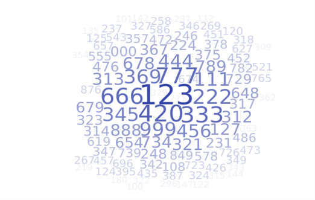

```{r setup, include=FALSE}
options(htmltools.dir.version = FALSE)
knitr::opts_chunk$set(echo = TRUE, include = TRUE, eval = TRUE, comment = NA, fig.height = 6)
```

```{r xaringan-themer, include = FALSE, warning = FALSE}
library(xaringanthemer)
# style_mono_light(base_color = "#00274c",
#                  header_font_google = google_font("DM Serif Display"),
#                  text_font_google = google_font("PT Sans", "400", "400i")
# )
style_duo(primary_color = "#00274c",
          secondary_color = "#ffcb05",
          header_font_google = google_font("DM Serif Display"),
          text_font_google = google_font("PT Sans", "400", "400i", "600"),
          code_font_google = google_font("Roboto Mono", "400"),
          text_font_size = "22pt"
)
```

```{r xaringanExtra, echo=FALSE}
xaringanExtra::use_webcam()
xaringanExtra::use_fit_screen()
```

class: center middle

# Reminders `r emo::ji("bulb")`

Your tasks for the week running Friday 10/2 - Friday 10/9:

| Task | Due Date | Submission |
|:-----|:---------|:-----------|
| M-Write 1 Final Revision | Wednesday 10/7| Canvas |
| Homework 5 | Friday 10/9 8AM ET | course.work |
| Lab 5 | Friday 10/9 8AM ET | Canvas |

Stop by office hours! You can attend anyone's -- not just mine!

M-Write office hours schedule on Canvas (see MWrite Info on home page)

---
# Homework 4 Comments

- Statistics is not a branch of math. It is a *mathematical science*.
  - In statistics, it's important that we tie our conclusions back to data.
--

- **context context context context context**
--

- *ALWAYS* put your answer back into the context of the problem. 
  - What does $R^2$ mean in *this* situation?
  - Why is regression useful to address *this* question?
  
<div style="text-align:center;"></img></div>
---
# Learning Objectives

.pull-left[
### Statistical Learning Objectives
1. Explore sample-to-sample variation
1. Investigate probability using long-run proportions
]
.pull-right[
### R Learning Objectives
1. Learn about reproducible randomness by "setting seeds"
1. Functions within functions: `table(sample())`
1. Line plots in R
]

---
# Weekly Advice

- Randomness is **random**: your mileage may vary when you run code inside chunks.
- Check your HTML file before submitting it! You'll notice formatting issues you can easily fix (often by adding blank lines to your Rmd file).

--
.pull-left[
Please try to follow along with this video. **It will help.**
]
.pull-right[
<br>
<div style="text-align:center;"></img></div>
]

---

# Vectors (again)

A *character* vector is a vector where the elements are "strings" of text.

```{r charVec}
x <- c("hi", "this is", "a character vector.", "Are you impressed?")
x
```

Again, note the use of the `c()` function.

--

<div style="text-align:center;"></img></div>

---
# `rep()`

What's easier to code? 

```{r petsMin}
pets <- c("cat", "cat", "cat", "cat")
pets
```
--
```{r repExample}
cats <- rep("cat", 4)
cats
```

--

`rep(`what you want to repeat`, `number of times to repeat it`)`

---
# `rep()`

What's easier to code?

```{r petsExample}
pets <- c("cat", "cat", "cat", "cat", "dog", "dog", "dog", "dog", "dog")
pets
```

```{r rep-c}
pets2 <- c(rep("cat", 4), rep("dog", 5))
pets2
```

---
# Functions in Functions
Arguments to functions can be functions! This is called **nesting**.

.pull-left[
```{r bigVectorRep-blowup}
table(
  c(
    rep("heads", 5000),
    rep("tails", 5000)
  )
)
```
]
.pull-right[
.center[

]
]

--

**WATCH OUT FOR PARENTHESES**

---
# Remember `sample()`?
We used `sample()` to simulate rolling a die using the vector `1:6`.

We can also give `sample()` a character vector to sample from!

```{r coinFlipping}
coin <- c('heads', 'tails')
sample(coin, size = 30, replace = TRUE)
```

---
# The `prob` argument to `sample()`

We can simulate a *biased* coin using the `prob` argument.

- `prob` takes a vector of "probability weights", one per element of the vector to sample from
- `prob` applies the weights *in order*

```{r biasedCoin}
coin <- c('heads', 'tails')
sample(coin, size = 30, replace = TRUE, prob = c(0.3, 0.7))
```

---
# Pseudo-random numbers

.pull-left[
- Humans are very bad at generating random numbers.
- Computers only **seem** better.
- Computers produce *pseudo-random* numbers: if you know the "seed", you know the entire sequence of "random" numbers.
]
.pull-right[

]

---
# `set.seed()`

- We can tell R to use a particular "seed" with `set.seed()`. 
- Setting the seed makes your randomness **reproducible**: you will now get the same answers (in your knitted document) as your peers, provided you use the same code.

```{r seed}
set.seed(8362)
sample(1:5000, size = 3)
```

---
# Line Graphs `r emo::ji("chart_with_upwards_trend")`

.pull-left[
Remember this?

```{r plotOfMeanOfEx1, fig.show = 'hide'}
sixSidedDieRoll <- function(n) {
  mean(sample(1:6, size = n, replace = T))
}
plot(sapply(1:300, sixSidedDieRoll), 
     main = "Law of Large Numbers Example",
     xlab = "Number of Six-Sided Dice",
     ylab = "Average")
```
]
.pull-right[
`)
]

---
# Line Graphs `r emo::ji("chart_with_upwards_trend")`

.pull-left[
We can make a line graph with the `type` argument to `plot()`:
```{r lineGraphL, fig.show = "hide"}
plot(sapply(1:300, sixSidedDieRoll), 
     main = "Law of Large Numbers Example",
     xlab = "Number of Six-Sided Dice",
     ylab = "Average",
     type = "l") #<<
```

Use `type = l` for a `l`ine graph (that's a **lowercase L**)
]
.pull-right[
`)
]

---
# Line Graphs `r emo::ji("chart_with_upwards_trend")`

.pull-left[
```{r lineGraphO, fig.show = "hide"}
plot(sapply(1:300, sixSidedDieRoll), 
     main = "Law of Large Numbers Example",
     xlab = "Number of Six-Sided Dice",
     ylab = "Average",
     type = "o", #<<
     pch = 20)
```

Use `type = o` to draw lines between points (and `pch` is back!)
]
.pull-right[
`)
]

---

# Line Graphs `r emo::ji("chart_with_upwards_trend")`

.pull-left[
```{r lineGraphCustom, fig.show = "hide"}
plot(sapply(1:300, sixSidedDieRoll), 
     main = "Law of Large Numbers Example",
     xlab = "Number of Six-Sided Dice",
     ylab = "Average",
     type = "o",
     pch = 20,
     lty = "dotted", #<<
     lwd = 2) #<<
```

- Use `lty` to specify `l`ine `ty`pe: (0=blank, 1=solid (default), 2=dashed, 3=dotted, 4=dotdash, 5=longdash, 6=twodash)
- Use `lwd` to specify `l`ine `w`i`d`th (default is 1)
]
.pull-right[
`)
]


---
# Lab Project `r emo::ji("keyboard")`

.pull-left[
### Your tasks
- Complete the "Try It!" and "Dive Deeper" portions of the lab assignment by copy/pasting and modifying appropriate code from earlier in the document.
]

.pull-right[
### How to get help
- Use the "labs" section of Piazza to ask questions and work with your peers.
- If you use Piazza, please note that in the "Collaborators" list at the top of the discussion section.
- If you're really stuck, email your lab instructor!
]

---
class: center middle

