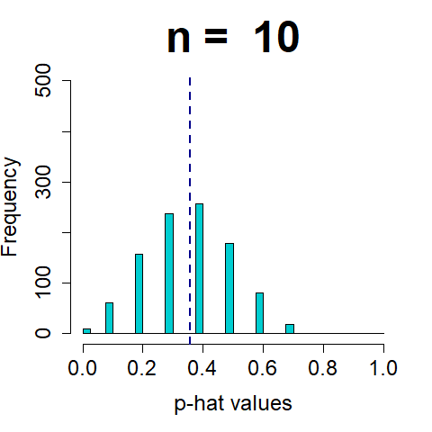

```{r setup, include=FALSE}
options(htmltools.dir.version = FALSE)
knitr::opts_chunk$set(echo = TRUE, include = TRUE, eval = TRUE, comment = NA, fig.height = 5, fig.width = 9)
source("sample_two_groups.R")
par(mar = c(5, 5.5, 4, 2) + 0.1)
```

```{r xaringan-themer, include = FALSE, warning = FALSE}
library(xaringanthemer)
# style_mono_light(base_color = "#00274c",
#                  header_font_google = google_font("DM Serif Display"),
#                  text_font_google = google_font("PT Sans", "400", "400i")
# )
style_duo(primary_color = "#00274c",
          secondary_color = "#ffcb05",
          header_font_google = google_font("DM Serif Display"),
          text_font_google = google_font("PT Sans", "400", "400i", "600"),
          code_font_google = google_font("Roboto Mono", "400"),
          text_font_size = "22pt"
)
```

```{r xaringanExtra, echo=FALSE}
xaringanExtra::use_webcam()
xaringanExtra::use_fit_screen()
```

class: center middle

# Reminders `r emo::ji("bulb")`

Your tasks for the week running Friday 10/19 - Friday 10/23:

| Task | Due Date | Submission |
|:-----|:---------|:-----------|
| Lab 8 | Friday 10/23 8:00AM ET | Canvas |
| *No homework this week* | -- | course.work |

Office hours are back to normal this week (with a few small tweaks)

Midterm regrade requests through Gradescope due **Tuesday 10/27 8a

---
class: center

# Midterm Recap


--

If the midterm didn't go as expected *that's OKAY*. There's plenty of semester left.

---

# What's the plan?

Today we're going to learn about "sampling distributions" and something called the **Central Limit Theorem** (CLT).

--

The central limit theorem is sort of magical. We'll talk about it in more detail in lecture!

<div style="text-align:center;"></div>

---
# Sampling Distributions

A **sampling distribution** refers to the possible values for a *statistic* (e.g., $\hat{p}$) and how often those values occur.

We've sort of seen sampling distributions already. Can you think of how?

--

The histograms we've made of $\hat{p}_{\mathrm{sim}}$ are sampling distributions of $\hat{p}$ (under the null hypothesis model)!

---
class: inverse

# Penguins!

```{r penguins}
penguins <- read.csv("https://raw.githubusercontent.com/STATS250SBI/palmerpenguins/master/inst/extdata/penguins_NArm.csv",
                     stringsAsFactors = TRUE)
```

<div style="text-align:center;"></div>

---
class: inverse
# Penguins!

Let's remind ourselves of what variables are in this data:

```{r penguinsExplore, error = T}
# Use your favorite function or two to explore the data

```

--

```{r penguinsExplore2, error = T}
# Use your favorite function or two to explore the data
names(penguins)
```

--

> IMPORTANT NOTE: For the purposes of this example, we're going to assume that the penguins in the data represent the *population* of all penguins in the Palmer Archipelago. This is obviously not true: there are more than 333 penguins living on these islands. *This is just to illustrate ideas*.

---
# "Population" proportions

Assuming our data is on the full population of penguins in the archipelago, how could we find the population proportion of Gentoo penguins?

--

```{r speciesProportions}
proportions(table(penguins$species))
```

--

$$p = 0.357$$
where $p$ is the population proportion of Gentoo penguins in the Palmer Archipelago

---

# `set.seed()`

Start by setting the seed:

```{r setSeed}
set.seed(7923)
```

Things to remember when setting the seed:

- Guaranteed to get the same results from the same code in the *knitted* document
- Determines the *sequence* of random numbers: things can get knocked off sequence
- Use "Run All Chunks Above" to get back on sequence and to get the same numbers as in the knitted document

---
# Taking a sample
Take a sample of size 20 from the "population" of all penguins:

```{r penguinSample1}
sample1 <- penguins[sample(1:333, size = 20), ]
```

--

```{r penguinSampleHead, echo = F}
head(sample1, 2)
```

--

```{r sample1GentooProp}
proportions(table(sample1$species))
```

---
# Taking *another* sample

```{r penguinSample2}
sample2 <- penguins[sample(1:333, size = 20), ] # reusing the same code as above
proportions(table(sample2$species))
```

We get different results! This is expected, it's *sample-to-sample variability*.

--

<div style="text-align:center;"></div>

---
# 1000 more samples
.pull-left[
```{r penguinSamples20}
samplesOfSize20 <- replicate(1000, {
  s <- penguins[sample(1:333, size = 20), ]
  proportions(table(s$species))["Gentoo"]
})
```

```{r samples20hist, fig.show = "hide", fig.width = 6, fig.height = 6}
hist(samplesOfSize20,
     main = "Sampling distribution of p-hat, n = 20",
     xlab = "p-hat values",
     col = "darkturquoise",
     xlim = c(0, 1),
     cex.lab = 1.5,
     cex.main = 1.5,
     cex.axis = 1.5)
abline(v = proportions(table(penguins$species))["Gentoo"],
       lwd = 5, lty = "dashed", col = "darkblue")
```
]
.pull-right[
`)
]

---
class: center, middle, inverse
# Describe this distribution

### https://pollev.com/nickseewald611

`)

---
# Larger samples: $n = 40$

.pull-left[
```{r penguinSamples40}
samplesOfSize40 <- replicate(1000, {
  s <- penguins[sample(1:333, size = 40), ]
  proportions(table(s$species))["Gentoo"]
})
```

```{r samples40hist, fig.show = "hide", fig.width = 6, fig.height = 6}
hist(samplesOfSize40,
     main = "Sampling distribution of p-hat, n = 40",
     xlab = "p-hat values",
     col = "darkturquoise",
     xlim = c(0, 1),
     cex.lab = 1.5,
     cex.main = 1.5,
     cex.axis = 1.5)
abline(v = proportions(table(penguins$species))["Gentoo"],
       lwd = 5, lty = "dashed", col = "darkblue")
```
]
.pull-right[
`)
]

---
class: center, middle, inverse
# How do these distributions compare?

https://pollev.com/nickseewald611

.pull-left[
`)
]
.pull-right[
`)
]

---
# Even larger samples: $n = 100$

.pull-left[
```{r penguinSamples100}
samplesOfSize100 <- replicate(1000, {
  s <- penguins[sample(1:333, size = 100), ]
  proportions(table(s$species))["Gentoo"]
})
```

```{r samples100hist, fig.show = "hide", fig.width = 6, fig.height = 6}
hist(samplesOfSize100,
     main = "Sampling distribution of p-hat, n = 100",
     xlab = "p-hat values",
     col = "darkturquoise",
     xlim = c(0, 1),
     cex.lab = 1.5,
     cex.main = 1.5,
     cex.axis = 1.5)
abline(v = proportions(table(penguins$species))["Gentoo"],
       lwd = 5, lty = "dashed", col = "darkblue")
```
]
.pull-right[
`)
]

---
class:center

# Comparing Results
https://pollev.com/nickseewald611
```{r histogramStack, fig.height = 6.5, fig.width = 12, echo = F}
# Don't worry about this code! Just for illustration
oldpar <- par()
par(mfrow = c(3, 1), xpd = NA, mar = c(1, 4, 1, 1) + .1)
x <- c(20, 40, 100)
for (n in x) {
  if (n == x[length(x)])
    par(mar = c(4, 4, 1, 1) + .1)
  hist(get(paste0("samplesOfSize", n)),
     main = paste("1000 samples, n =", n),
     xlab = ifelse(n == x[length(x)], "p-hat values", ""),
     col = "darkturquoise",
     breaks = seq(0, 1, .05),
     xlim = c(0, 1),
     ylim = c(0, 400), xaxt = "n",
     cex.lab = 1.5, cex.main = 1.5)
}
axis(side = 1, at = seq(0, 1, .1), labels = paste0(seq(0, 1, .1)),
     cex = 1.5)
segments(proportions(table(penguins$species))["Gentoo"], 0, 
         proportions(table(penguins$species))["Gentoo"], 2000, 
         lwd = 5, lty = "dashed", col = "darkblue")
```


---
# More Detail

.pull-left[
<div style="text-align:center;"></div>
]
.pull-right[
As the size of our samples increases, the sampling distribution of $\hat{p}$ becomes...


1. more obviously centered around $p$
1. narrower
1. more bell-shaped
]

---
# Central Limit Theorem

> If we look at a proportion (or difference in proportions) and the scenario satisfies certain conditions, then the sample proportion (or difference in proportions) will appear to follow a bell-shaped curve called the *normal distribution*.

--

##Conditions:

1. **Observations in the sample are independent.** Guaranteed by random sampling or random allocation to treatment/control.
1. **The sample is large enough.** "Large enough" means $n\times p \geq 10$ *and* $n\times (1-p) \geq 10$ ($p$ the *population* proportion).

---
class: inverse
# Lab Project `r emo::ji("keyboard")`

.pull-left[
### Your tasks
- Complete the "Try It!" and "Dive Deeper" portions of the lab assignment by copy/pasting and modifying appropriate code from earlier in the document.
- Introduce yourself to your collaborators
- **Do not leave people behind.**
]

.pull-right[
### How to get help
- Ask your collaborators -- share your screen!
- Use the "Ask for Help" button to flag me down.
]

---

class: center middle

# Reminders `r emo::ji("bulb")`

### http://bit.ly/250ticket8

Your tasks for the week running Friday 10/19 - Friday 10/23:

| Task | Due Date | Submission |
|:-----|:---------|:-----------|
| Lab 8 | Friday 10/23 8:00AM ET | Canvas |
| *No homework this week* | -- | course.work |

Office hours are back to normal this week (with a few small tweaks)

Midterm regrade requests through Gradescope due **Tuesday 10/27 8a