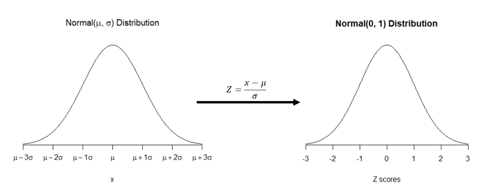

```{r setup, include=FALSE}
options(htmltools.dir.version = FALSE)
knitr::opts_chunk$set(echo = TRUE, include = TRUE, eval = TRUE, comment = NA, fig.height = 5, fig.width = 9)
source("plotNorm.R")
source("sample_two_groups.R")
par(mar = c(5, 5.5, 4, 2) + 0.1)
set.seed(1875)
```

```{r xaringan-themer, include = FALSE, warning = FALSE}
library(xaringanthemer)
# style_mono_light(base_color = "#00274c",
#                  header_font_google = google_font("DM Serif Display"),
#                  text_font_google = google_font("PT Sans", "400", "400i")
# )
style_duo(primary_color = "#00274c",
          secondary_color = "#ffcb05",
          header_font_google = google_font("DM Serif Display"),
          text_font_google = google_font("PT Sans", "400", "400i", "600"),
          code_font_google = google_font("Roboto Mono", "400"),
          text_font_size = "22pt"
)
```

```{r xaringanExtra, echo=FALSE}
xaringanExtra::use_webcam()
xaringanExtra::use_fit_screen()
xaringanExtra::use_editable()
xaringanExtra::use_panelset()
xaringanExtra::use_tachyons()
```

class: center middle

# Reminders `r emo::ji("bulb")`

Your tasks for the week running Friday 10/23 - Friday 10/30:

| Task | Due Date | Submission |
|:-----|:---------|:-----------|
| Lab 9 | Friday 10/30 8:00AM ET | Canvas |
| Homework 6 | Friday 10/30 8:00AM ET | course.work |

Midterm regrade requests through Gradescope due **Tuesday 10/27 8am ET**

M-Write Prompt 2 opens Wednesday 10/28 at 5pm ET

---
# Weekly Advice

PLEASE PLEASE PLEASE WATCH YOUR PARENTHESES

- Every open parenthesis or bracket must be closed
- Arguments to functions go *inside* parentheses and are separated by commas: `abline(v = 1, col = "blue")`

--

.center[]

---
# Probability Distributions

.bg-washed-yellow.b--yellow.navy.ba.bw2.ph4[
A .b[distribution] refers to the possible values a random variable can take as well as the probability that it takes those values.
]

Here's an example distribution of a random variable $X$:

.center[
|$x_i$ | 0 | 1 | 2 | 3 |
|:----:|:--|:--|:--|:--|
|$P(X = x_i)$ | 0.5 | 0.1 | 0.3 | 0.1 |
]

---
# The Normal Distribution

- An *extremely* common distribution in statistics
- Used to describe all sorts of stuff
  - "All models are wrong; some are useful." -George Box
  
```{r normal1, echo = F, fig.align = "center"}
plotNorm(mean = 0, sd = 1, main = "Standard Normal Distribution, N(0, 1)", cex = 2)
```

???
Type in chat: describe distribution

---
# The Normal Distribution

- There are an **infinity** of normal distributions. 

- To describe which one we're working with, you need to specify the **mean** and the **standard deviation** of the distribution.
  - Those two numbers *completely describe* the distribution.
  
- We write $\mathrm{Normal}(\mu, \sigma)$ or $N(\mu, \sigma)$
  - $\mu$ (mu) is the population mean
  - $\sigma$ (sigma) is the population standard deviation

---
# A Selection of Normal Distributions

.center[
```{r normalPlots, echo = F, fig.width = 13, fig.height = 7}
oldmar <- par("mar")
par(mfrow = c(1, 3), mar = c(5, 1, 4, 1) + .1)
plotNorm(mean = 10, sd = 1, main = "N(10, 1)", cex.main = 4)
plotNorm(mean = 10, sd = 5, main = "N(10, 5)", cex.main = 4)
plotNorm(mean = 30, sd = 15, main = "N(30, 15)", cex.main = 4)
par(mfrow = c(1, 1), mar = oldmar)
```
]

???
TYPE IN CHAT: describe differences in these three

---
# Z Scores

- We can **standardize** a random variable $X$ by subtracting its mean and dividing by the standard deviation.

- If $X$ follows a $N(\mu, \sigma)$ distribution, the standardized version is called a **Z score**.

$$Z = \frac{x - \mu}{\sigma}$$
---
# Z Scores

- It's easy to compare things on the same scale, so we standardize. 
- Often easier to work with *one* normal distribution: the *standard* normal, $N(0,1)$. 

.center[

]

---
class: inverse center middle
# GIF BREAK!
## What questions do you have so far?


---
# Probability with Normal Distributions

- Given a normally-distributed random variable $X$, the probability of taking on a certain range of values is the area under the normal curve over those values.
- If $X$ follows a $N(45, 6)$ distribution, $P(X < 35)$ is

.pull-left[
```{r plot1, fig.show='hide'}
plotNorm(mean = 45, 
         sd = 6,
         shadeValues = 35,
         direction = "less",
         cex.main = 2)
```

```{r pNorm1}
pnorm(q = 35, mean = 45, sd = 6)
```
]
.pull-right[
`)
]

---
# Standardization Works

- Let $X$ have a $N(45, 6)$ distribution. Find $P(X < 35)$.

$$ z = \frac{35-45}{6} = -1.667 $$

```{r pnormZ}
pnorm(q = -1.667, mean = 0, sd = 1)
```

---
# Probability with Normal Distributions

We can also find probabilities of "greater than" events. Again, let $X$ be $N(45, 6)$ and find $P(X > 50)$. 

`pnorm()` by default finds *less than* probabilities (area to the *left*)

.pull-left[
```{r pnorm50}
pnorm(50, mean = 45, sd = 6)
```
]
.pull-right[
```{r pnorm50graph, echo = F}
plotNorm(mean = 45, sd = 6, shadeValues = 50, direction = "less", cex.main = 2)
```
]

---
# Probability with Normal Distributions

How do we deal with `pnorm()` shading to the left?

```{r pnorm50}
```

.pull-left[

### Strategy 1
Use the fact that the total area under the normal curve is 1:

```{r pnorm50up1}
1 - pnorm(50, mean = 45, sd = 6)
```
]

.pull-right[

### Strategy 2
Set the `lower.tail` argument to `FALSE`:
```{r pnorm50up2}
pnorm(50, mean = 45, sd = 6, lower.tail = FALSE)
```
]

---
# Probability with Normal Distributions
How could we find P(35 < X < 50), again if $X$ has a N(45, 6) distribution?

.pull-left[
```{r plot3-50, fig.show = "hide"}
plotNorm(mean = 45, sd = 6,
         shadeValues = 50,
         direction = "less", #<<
         col.shade = "tomato", #<<
         cex.main = 2)
```

```{r pnormMiddleExample1}
pnorm(50, mean = 45, sd = 6)
```
]
.pull-right[
`)
]
---
# Probability with Normal Distributions
How could we find P(35 < X < 50), again if $X$ has a N(45, 6) distribution?

.pull-left[
```{r plot3-35, fig.show = "hide"}
plotNorm(mean = 45, sd = 6,
         shadeValues = 35,
         direction = "less", #<<
         col.shade = "darkblue", #<<
         cex.main = 2)
```

```{r pnormMiddleExample2}
pnorm(35, mean = 45, sd = 6)
```
]
.pull-right[
`)
]

---
# Probability with Normal Distributions
How could we find P(35 < X < 50), again if $X$ has a N(45, 6) distribution?

.pull-left[
```{r plot3final, fig.show = "hide"}
plotNorm(mean = 45, sd = 6,
         shadeValues = c(35, 50),
         direction = "inside", #<<
         col.shade = "tomato", #<<
         cex.main = 2)
```

```{r pnormMiddleExampleFinal}
pnorm(50, mean = 45, sd = 6) -
  pnorm(35, mean = 45, sd = 6)
```
]
.pull-right[
`)
]

---
class: inverse, center, middle
# GIF BREAK

## What questions do you have?


---
# Percentiles of the Normal Distribution

.bg-washed-yellow.b--yellow.navy.ba.bw2.ph4[
The $x$th .b[percentile] of a distribution is the value of a random variable such that $x$% of the distribution is less than that value. 
]

- Scoring in the 80th percentile on an exam means you got a higher score than 80% of test takers (equivalently, 80% of test takers scored less than you).
- Use `qnorm()` to find percentiles of the normal distribution.

Let's find the 4.8th percentile of the $N(45, 6)$ distribution.
```{r qnorm}
qnorm(p = .048, mean = 45, sd = 6)
```

---
# Percentiles of the Normal Distribution

Let's find the 30th percentile of the standard normal distribution, N(0, 1).

```{r qnorm2}
qnorm(p = 0.3) # notice no mean or sd arguments! The defaults are 0 and 1.
qnorm(p = 0.3, mean = 0, sd = 1)
```

**Type in the chat:** Why is this number negative?
---
# Percentiles of the Normal Distribution

`qnorm(p = 0.3, mean = 0, sd = 1)` gives us a Z score!
Use this to find the 30th percentile of the $N(45, 6)$ distribution.

$$Z = \frac{x - \mu}{\sigma}$$
Take a minute to fill in the chunks on line 163 and 171.

???
Give students time to fill in chunk on line 163. 
Then, give them time to check their answer on 172.
--
```{r findXfromZ}
qnorm(0.3) * 6 + 45
```

```{r checkZ}
qnorm(0.3, mean = 45, sd = 6)
```

---
class: inverse
# Code Cheat Sheet `r emo::ji("computer")`
### `pnorm(q, mean = 0, sd = 1, lower.tail = TRUE)`
- **`q`** refers to the value you want to find the area above or below
  - `pnorm(q, 0, 1)` gives $P(Z < q)$ where $Z$ is $N(0,1)$
- **`mean`** refers to $\mu$, defaults to 0
- **`sd`** refers to $\sigma$, defaults to 1
- **`lower.tail`** controls which direction to "shade": `lower.tail = TRUE` goes less than `q`, `lower.tail = FALSE` goes greater than `q`; defaults to `TRUE`

---
class: inverse
# Code Cheat Sheet `r emo::ji("computer")`
### `qnorm(p, mean = 0, sd = 1, lower.tail = TRUE)`
- **`p`** refers to the area under the curve
  - `qnorm(p, 0, 1)` is the number such that the area to the left of it is `p`
- **`mean`** refers to $\mu$, defaults to 0
- **`sd`** refers to $\sigma$, defaults to 1
- **`lower.tail`** controls which direction to "shade": `lower.tail = TRUE` goes less than `q`, `lower.tail = FALSE` goes greater than `q`; defaults to `TRUE`

---
class: inverse
# Code Cheat Sheet `r emo::ji("computer")`
### `plotNorm(mean = 0, sd = 1, shadeValues, direction, col.shade, ...)`
- **`mean`** refers to $\mu$, defaults to 0
- **`sd`** refers to $\sigma$, defaults to 1
- **`shadeValues`** is a vector of up to 2 numbers that define the region you want to shade
- **`direction`** can be one of `less`, `greater`, `outside`, or `inside`, and controls the direction of shading between `shadeValues`. Must be `less` or `greater` if `shadeValues` has only one element; `outside` or `inside` if two
- **`col.shade`** controls the color of the shaded region, defaults to `"cornflowerblue"`
- **`...`** lets you specify other graphical parameters to control the appearance of the normal curve (e.g., `lwd`, `lty`, `col`, etc.)
---
class: inverse
# Lab Project `r emo::ji("keyboard")`

.pull-left[
### Your tasks
- Complete the "Try It!" and "Dive Deeper" portions of the lab assignment by copy/pasting and modifying appropriate code from earlier in the document.
- Introduce yourself to your collaborators
- **Do not leave people behind.**
]

.pull-right[
### How to get help
- Ask your collaborators -- share your screen!
- Use the "Ask for Help" button to flag me down.
]

---

class: center middle

# Reminders `r emo::ji("bulb")`

### http://bit.ly/250ticket9

Your tasks for the week running Friday 10/23 - Friday 10/30:

| Task | Due Date | Submission |
|:-----|:---------|:-----------|
| Lab 9 | Friday 10/30 8:00AM ET | Canvas |
| Homework 6 | Friday 10/30 8:00AM ET | course.work |

Midterm regrade requests through Gradescope due **Tuesday 10/27 8am ET**

M-Write Prompt 2 opens Wednesday 10/28 at 5pm ET