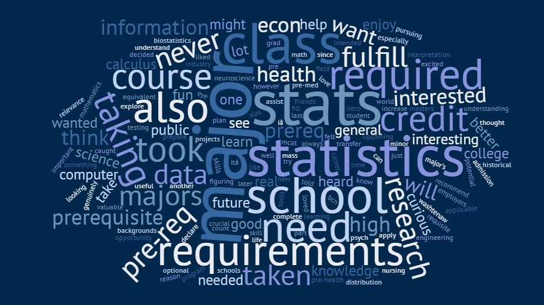

```{r setup, include=FALSE}
options(htmltools.dir.version = FALSE)
knitr::opts_chunk$set(echo = TRUE, include = TRUE, eval = TRUE, comment = NA)
```

```{r xaringan-themer, include = FALSE, warning = FALSE}
library(xaringanthemer)
# style_mono_light(base_color = "#00274c",
#                  header_font_google = google_font("DM Serif Display"),
#                  text_font_google = google_font("PT Sans", "400", "400i")
# )
style_duo(primary_color = "#00274c",
          secondary_color = "#ffcb05",
          header_font_google = google_font("DM Serif Display"),
          text_font_google = google_font("Source Sans Pro", "400", "400i", "600"),
          code_font_google = google_font("Source Code Pro", "400"),
          text_font_size = "22pt"
)
```

```{r xaringanExtra, echo=FALSE}
xaringanExtra::use_webcam()
xaringanExtra::use_fit_screen()
```


# What happened with this (historic) strike?
- I am in a labor union, the Graduate Employees' Organization (GEO).
  - One of the oldest grad employee unions in the US!
- A strike is a union's "nuclear option" and is only used when all else fails. It is not (and was not) a decision taken lightly by GEO membership.
--

- Longest GEO strike since 1975
- Massive cross-campus and national support
- Forced U-M to talk about issues they've ignored for years
--

- Ended not because deal was good; U-M severely threatened "union security"
- The real work starts *now*

---
# My commitment to you

- Administrators say strike was to your detriment; I disagree
   - Goal was to ensure safe campus for *all* community members
- The fight continues!
  - RA's still on strike
  - MDining and other staff groups still fighting for better conditions
  - DPSS still has a higher budget than the Rackham Graduate School

--

**I am here to support you. Let me know how.**

http://bit.ly/250strikesupport

---

# Who are you? `r emo::ji("woman_student")`

```{r importSurvey, echo = F, include = F}
survey <- read.delim("introSurvey.tsv")
names(survey) <- c("timestamp", "email", "name", "section", "from", "currLoc", 
                   "year", "major", "show", "taking", "fear", "learn", "etc")
survey$show <- gsub(" ", "", tolower(survey$show))

head(sort(table(survey$show), decreasing = T))
head(sort(table(survey$major), decreasing = T))
```

.pull-left[
#### Favorite TV Shows
1. The Office
1. Bojack Horseman
1. Game of Thrones
1. Grey's Anatomy

#### Top Majors
1. Computer Science
1. BCN
1. Economics
1. Neuroscience
]

--
.pull-right[
#### Year at U-M
```{r yearPlot, echo = F, out.height="380px", fig.width = 9, out.extra='style="align:center;"'}
library(viridisLite)
survey$year <- factor(survey$year, levels = c("Freshman", "Sophomore", "Junior", "Senior"))
barplot(table(survey$year, useNA = "no"), cex.names = 1.7, cex.axis = 2,
        col = inferno(4, begin = .2))
```
]

---

# Why are you taking this class?

<div style="text-align:center;"></div>

---
background-image: url("img/wordcloud_fear.jpg")
<!-- background-position: 50% 50% -->
background-size: contain

# What are you afraid of?

---
# Notes on common fears

.pull-left[
### Math
- **This is not a math class.** The focus is not on doing algebra or manipulating formulas. There are numbers, but we're more interested in *conceptual understanding* of statistical ideas.
- **It's okay if you haven't taken stats before.** 63% of students in class didn't take stats in high school.
]
--
.pull-right[
### Coding
- **This is not a coding class.** You'll learn some things about coding, but the focus is **not** on learning to code. Once you get the basics of R, we'll turn more towards statistics.
- Learning to code is about **trial and error**. Stick with it!
- I've been using R for a decade and I Google stuff *constantly*.
]

---
# Notes on common fears

.pull-left[
### Staying on Track
- **Spend at least 20-30 minutes on statistics every day.** Reviewing material in small chunks will help reinforce the concepts (and make exam prep easier!)
- **Use resources.** eCoach has to-do lists for each week, and the Canvas homepage has one too!
]
--
.pull-right[
### "I'm bad at stats/math/etc."
- **FALSE.** Success in this course reflects *effort* not baseline ability.
- You *will* make mistakes, but *that's how humans learn*.
- "Negative self-talk will limit you." (Christina Knudson, Ph.D.)
- YOU `r emo::ji("clap")` CAN `r emo::ji("clap")` DO `r emo::ji("clap")` IT
]

---
# Notes on common fears

.pull-left[
### Remote learning
- **Reasonable!** These are challenging times. Try to make the best of it, but we're all going to struggle with it.
- **Your humanity comes first**
- Remember that **I am here to help**
]
--
.pull-right[
### Picky wording
- **Generally a thing of the past.** 
- Focus on conveying your ideas as precisely as you can

### "I'm going to fail the class"
- Reframe "I have to get X grade" to "I *want* to get X grade"
- "Negative self-talk will limit you."
]

---
class: middle,center,inverse

# YOU CAN DO IT!

##http://bit.ly/250strikesupport


